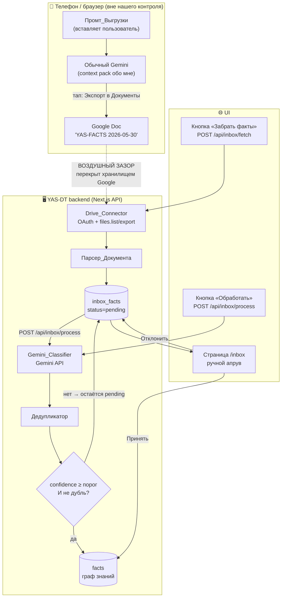
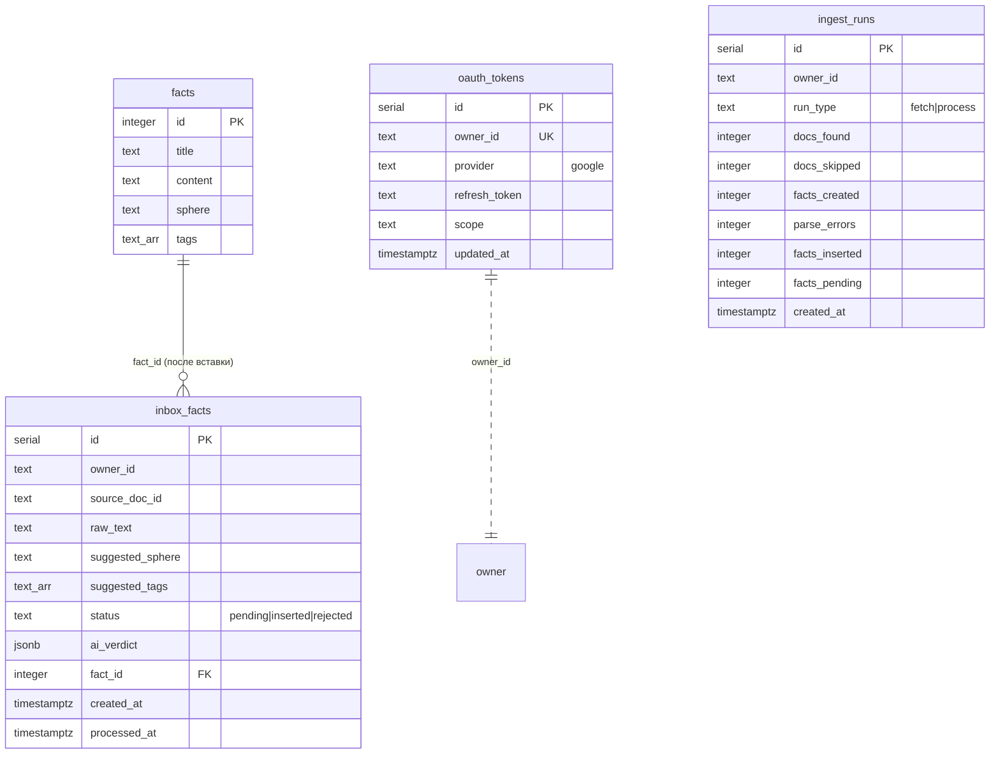

# Design Document

## Overview

Этот дизайн описывает реализацию ingest-пайплайна YAS-DT v2.4 — конвейера наполнения семантического графа знаний фактами, полученными в обычном (бесплатном) Gemini.

Ключевая архитектурная проблема — «воздушный зазор»: бесплатный Gemini не имеет исходящего API и не может писать в нашу БД напрямую. Зазор перекрывается хранилищем Google: Gemini одним тапом экспортирует ответ в Google Doc, а наш бэкенд читает этот Doc через Drive API. Дальше всё под нашим контролем.

Дизайн опирается на существующий код проекта:
- паттерн API-роутов (`app/api/*/route.ts` с модульным `createClient`);
- логику классификации из `scripts/classify-facts.ts` (Gemini REST API, модель `gemini-flash-lite-latest`, словари сфер/тегов);
- сложившийся паттерн SQL-патчей (`scripts/*.sql`, применяются вручную через Supabase Dashboard).

### Принципы дизайна

1. **Staging, а не прямая запись.** Факты сначала попадают в `inbox_facts` (status=pending), и только после проверки — в `facts`. Это даёт идемпотентность, модерацию и отладку.
2. **Разделение fetch/process.** Забор из Drive и обработка через Gemini — две независимые операции, перезапускаемые по отдельности.
3. **Fail-closed.** Любой сбой (OAuth, Gemini, парсинг) оставляет факт в `pending`, а не теряет и не вставляет наугад.
4. **Фундамент под мультиарендность.** `owner_id` во всех новых таблицах с самого начала.
5. **Единый источник правды для словаря.** `lib/vocabulary.ts` заменяет три разрозненных хардкода.

### Out of Scope (с точками расширения)

- Семантическая дедупликация через pgvector — оставлен задел в `Дедупликаторе` и колонке-комментарии.
- Автопредложение связей (v2.5) — `fact_relations` не трогаем, но вставка факта изолирована в сервис, куда позже добавится шаг связей.
- RAG-ассистент, активный сбор, биллинг, RLS.

## Architecture

### Поток данных



### Компоненты и их расположение

| Компонент | Файл | Ответственность |
|-----------|------|-----------------|
| Конфиг_Словаря | `lib/vocabulary.ts` | Единый источник сфер/тегов/лейблов |
| Контракт + Парсер | `lib/ingest/parser.ts` | Грамматика выгрузки и разбор текста Doc |
| Промт_Выгрузки | `lib/ingest/prompt.ts` | Генерация текста промта |
| Drive_Connector | `lib/google/drive.ts` | OAuth-токены, поиск и экспорт Docs |
| OAuth flow | `lib/google/oauth.ts` | Authorization Code flow, refresh |
| Gemini_Classifier | `lib/ingest/classifier.ts` | Вызов Gemini API, валидация, confidence |
| Дедупликатор | `lib/ingest/dedup.ts` | Нормализация и сравнение с графом |
| Вставка факта | `lib/ingest/factWriter.ts` | Генерация id, запись в `facts` |
| Supabase-хелпер | `lib/db.ts` | Серверный клиент (DRY вместо дубля createClient) |
| OAuth consent | `app/api/auth/google/route.ts` | Старт OAuth |
| OAuth callback | `app/api/auth/google/callback/route.ts` | Приём кода, сохранение refresh_token |
| Эндпоинт_Fetch | `app/api/inbox/fetch/route.ts` | Drive → парс → pending |
| Эндпоинт_Process | `app/api/inbox/process/route.ts` | pending → Gemini → решение |
| Очередь | `app/api/inbox/route.ts` | GET pending |
| Апрув / реджект | `app/api/inbox/[id]/approve/route.ts`, `.../reject/route.ts` | Ручные действия |
| Страница очереди | `app/inbox/page.tsx` | UI модерации + кнопки fetch/process |
| Страница подключения | `app/connect/page.tsx` | Кнопка Google + копируемый промт |
| SQL-патч | `scripts/add-inbox-tables.sql` | DDL новых таблиц |

## Components and Interfaces

### 1. Конфиг_Словаря (`lib/vocabulary.ts`)

Единый источник правды. Заменяет `SPHERE_LABELS` в `app/graph/page.tsx` и `SPHERES`/`TAG_VOCABULARY` в `scripts/classify-facts.ts`.

```typescript
export type Sphere =
  | 'loved' | 'family' | 'friends' | 'career'
  | 'physical' | 'mental' | 'hobby' | 'wealth';

export const SPHERES: readonly Sphere[];

export const SPHERE_LABELS: Record<Sphere, string>;  // '💖 Любимые' и т.д.
export const SPHERE_COLORS: Record<Sphere, string>;  // для графа

export const TAG_VOCABULARY: {
  type:    readonly string[];
  context: readonly string[];
  stage:   readonly string[];
};

export function isValidSphere(s: string): s is Sphere;
export function allowedTags(): Set<string>;
export function isValidTag(t: string): boolean;
```

**Точка расширения под HPI:** модуль экспортирует данные через функции/константы, а не инлайнит их. Позже внутренности можно заменить на загрузку из внешнего HPI-источника, сохранив тот же интерфейс — потребители (`classifier`, `parser`, граф, `/inbox`) не изменятся. (Req 2.7)

Граф (`app/graph/page.tsx`) и `classify-facts.ts` рефакторятся на импорт из этого модуля.

### 2. Контракт_Выгрузки и Парсер_Документа (`lib/ingest/parser.ts`)

#### Грамматика

```
DOCUMENT     := HEADER FACT_BLOCK+ FOOTER?
HEADER       := "=== YAS-FACTS " <дата> " ==="
FACT_BLOCK   := "--- FACT ---" FIELD+
FOOTER       := "=== END ==="            (необязателен)
FIELD        := SPHERE_LINE | TAGS_LINE | TEXT_LINES
SPHERE_LINE  := "sphere:" <значение>      (опционально)
TAGS_LINE    := "tags:" <csv>             (опционально)
TEXT_LINES   := "text:" <многострочный текст до следующего маркера>  (обязательно)
```

#### Пример

```
=== YAS-FACTS 2026-05-30 ===
--- FACT ---
sphere: physical
tags: sport, growth
text: Начал бегать по утрам, 3 раза в неделю, с конца мая 2026.

--- FACT ---
text: Поспорил с партнёром по Robius о стратегии масштабирования —
решили разделить ответственность по модулям.
=== END ===
```

#### Интерфейс

```typescript
export interface ParsedFact {
  text: string;                 // обязателен
  suggestedSphere?: string;     // подсказка, не валидируется здесь
  suggestedTags?: string[];
}

export interface ParseResult {
  facts: ParsedFact[];
  errors: ParseError[];         // блоки без text / пустые
}

export interface ParseError {
  blockIndex: number;
  reason: 'missing_text' | 'empty_text' | 'malformed';
  snippet: string;              // первые ~80 символов блока для отладки
}

export function parseDocument(raw: string): ParseResult;
```

#### Алгоритм

1. Нормализовать переводы строк (`\r\n` → `\n`).
2. Найти HEADER; если нет — всё равно пытаемся разобрать (Gemini мог не поставить заголовок), но помечаем мягким предупреждением.
3. Разбить по `--- FACT ---` на блоки.
4. В каждом блоке построчно извлечь `sphere:`, `tags:`; всё после `text:` (включая многострочный хвост до следующего маркера или конца блока) — это `text`.
5. **Устойчивость к «ёлочкам»:** маркеры ищутся по `startsWith` после `trim`, имена полей сравниваются регистронезависимо; кавычки в значениях не интерпретируются (формат не JSON). Это снимает риск автозамены `"` → `«»` в Docs. (Req 3.6)
6. Блок без `text` или с пустым `text` → `ParseError`, не попадает в `facts`. (Req 3.8)
7. Ноль блоков → `{ facts: [], errors: [] }`, успешное завершение. (Req 3.9)
8. Частичное наличие подсказок (`sphere` есть, `tags` нет) — берём что есть, отсутствующее = undefined. (Req 3.5)

### 3. Промт_Выгрузки (`lib/ingest/prompt.ts`)

```typescript
export function buildExportPrompt(date: string): string;
```

Возвращает готовый русский текст для вставки в обычный Gemini. Промт:
- инструктирует формат Контракта_Выгрузки с маркерами;
- задаёт префикс `YAS-FACTS <дата>` (станет именем Doc после экспорта);
- помечает `text` обязательным, `sphere`/`tags` — опциональными подсказками из словаря;
- просит НЕ использовать JSON и markdown-таблицы.

Показывается на `app/connect/page.tsx` как копируемый блок (Req 4.5). Обязательность `text` дополнительно жёстко проверяется парсером независимо от формулировок промта (Req 4.4).

### 4. Drive_Connector и OAuth (`lib/google/oauth.ts`, `lib/google/drive.ts`)

#### Решение: библиотека `googleapis`

**Рекомендация:** использовать официальный пакет `googleapis`.
- **За:** инкапсулирует OAuth-обновление токенов, retry, типы Drive API; меньше ручного кода и багов в подписи запросов.
- **Против:** тяжёлый пакет.
- **Альтернатива (прямой fetch):** легче по весу, но придётся вручную реализовывать refresh-flow и пагинацию `files.list` — больше точек отказа.

Учитывая, что OAuth-refresh — критичный по безопасности код (Req 5, 12), надёжность важнее веса бандла (это серверный код, в браузер не идёт). Берём `googleapis`.

#### Решение: хранение refresh_token в таблице `oauth_tokens`, а не в env

**Обоснование:**
- refresh_token выдаётся в рантайме после consent — его нельзя знать на этапе деплоя, значит env не подходит как первичное хранилище.
- Таблица с `owner_id` — естественный задел под мультиарендность (Req 1): у каждого владельца свой токен.
- Альтернатива (писать в env/файл) ломается при serverless-деплое и не масштабируется на нескольких владельцев.

#### OAuth flow (Authorization Code)

```
GET /api/auth/google
  → редирект на Google consent (scope=drive.readonly, access_type=offline,
    prompt=consent, state=<csrf-token в httpOnly cookie>)

GET /api/auth/google/callback?code=...&state=...
  → сверка state с cookie (защита от CSRF)
  → обмен code на access_token + refresh_token
  → upsert в oauth_tokens (owner_id, refresh_token, ...)
  → редирект на /connect?connected=1
```

#### Интерфейс

```typescript
// oauth.ts
export function buildConsentUrl(state: string): string;
export async function exchangeCode(code: string): Promise<GoogleTokens>;
export async function getAccessToken(ownerId: string): Promise<string>;
//   ↑ читает refresh_token из oauth_tokens, обновляет access_token,
//     бросает ReauthRequiredError если refresh отклонён (Req 5.5)

// drive.ts
export interface DriveDoc { id: string; name: string; modifiedTime: string; }
export async function listFactDocs(ownerId: string): Promise<DriveDoc[]>;
//   files.list q="name contains 'YAS-FACTS' and mimeType='application/vnd.google-apps.document'"
export async function exportDocText(ownerId: string, docId: string): Promise<string>;
//   files.export mimeType='text/plain'
```

### 5. Gemini_Classifier (`lib/ingest/classifier.ts`)

Рефакторинг логики из `scripts/classify-facts.ts` в переиспользуемый сервис. Скрипт классификации позже тоже сможет импортировать его.

```typescript
export interface ClassifyInput {
  text: string;
  suggestedSphere?: string;
  suggestedTags?: string[];
}

export interface ClassifyResult {
  title: string;          // короткий заголовок, сгенерированный моделью (для дедупа и facts.title)
  sphere: Sphere;
  tags: string[];
  weight: number;         // 0.50..1.00
  confidence: number;     // 0..1 — самооценка уверенности модели
}

export type ClassifyOutcome =
  | { ok: true; result: ClassifyResult }
  | { ok: false; error: 'api_error' | 'parse_error' | 'validation_error'; detail: string };

export async function classifyFact(input: ClassifyInput): Promise<ClassifyOutcome>;
```

**Детали:**
- Вызов того же эндпоинта Gemini REST API, что и в скрипте: `gemini-flash-lite-latest`, `responseMimeType: application/json`, temperature 0.2.
- Промт просит вернуть JSON-объект с полями `title, sphere, tags, weight, confidence`. Confidence — самооценка модели (0..1), используется как Порог_Confidence-сигнал (Req 8.2).
- Экспоненциальный backoff на 429 (переносим из скрипта).
- Валидация `sphere`/`tags` против `Конфиг_Словаря`; невалидные теги отбрасываются, невалидная сфера → `validation_error` (fail-closed, Req 2.5).
- Любая ошибка возвращается как `ok:false` — вызывающий код оставит факт в `pending` и запишет причину в `ai_verdict` (Req 8.6, 8.7).

### 6. Дедупликатор (`lib/ingest/dedup.ts`)

```typescript
export function normalize(s: string): string;
//   lowercase → trim → схлопывание пробелов → удаление пунктуации

export interface DupCheck { isDuplicate: boolean; matchedFactId?: number; }
export async function checkDuplicate(title: string, text: string): Promise<DupCheck>;
```

**Алгоритм (простой, Req 10):**
1. `normalize(title)` нового факта.
2. Запрос к `facts`: сравнение нормализованного `title` и нормализованного первого фрагмента `content` (первые ~120 символов).
3. Точное совпадение нормализованных строк → дубликат, возвращаем `matchedFactId`.

**Trade-off:** ловит дословные/почти дословные повторы, но не семантические перефразировки («бегаю по утрам» vs «начал утренние пробежки»).

**Задел под pgvector:** интерфейс `checkDuplicate` синхронен по смыслу и инкапсулирует стратегию. В v2.5 внутренность заменяется на эмбеддинг + поиск ближайших, сигнатура сохраняется. В DDL `facts` зарезервируем комментарий под будущую колонку `embedding vector`.

### 7. Вставка факта (`lib/ingest/factWriter.ts`)

```typescript
export interface NewFact {
  title: string; content: string; sphere: Sphere;
  tags: string[]; weight: number; ownerId: string;
}
export async function insertFact(f: NewFact): Promise<number>; // вернёт id
```

#### Решение: генерация id факта

`facts.id` — `INTEGER PRIMARY KEY` без автоинкремента (исторически id присваивались вручную при миграции).

**Выбранный подход для v2.4: `MAX(id)+1` в момент вставки.**
- **За:** не требует менять схему существующей таблицы и рисковать данными; минимальное изменение.
- **Против:** теоретическая гонка при параллельных вставках. В нашем сценарии (один владелец, последовательная обработка очереди) гонки практически нет; дополнительно оборачиваем выборку max и insert так, чтобы при коллизии PK сделать один retry с пересчётом max.

**Рекомендуемый путь на будущее (вынесен в задел, не делаем сейчас):** перевести `facts.id` на `IDENTITY`/`sequence` отдельной миграцией. Это чище, но затрагивает существующие данные и legacy-скрипты миграции — отдельная задача вне scope v2.4.

`content` для нового факта = `raw_text` (полный текст из выгрузки); `title` = из `ClassifyResult`. `category`/`section` (NOT NULL в схеме) заполняем дефолтами (`category='ingested'`, `section='inbox'`) — это не ломает существующий граф и помечает происхождение узла.

## Data Models

### ER-диаграмма



### DDL (`scripts/add-inbox-tables.sql`)

Применяется вручную через Supabase Dashboard → SQL Editor (паттерн проекта).

```sql
-- YAS-DT v2.4: ingest-пайплайн — staging, логи, OAuth-токены

-- 1. Staging новых фактов
CREATE TABLE IF NOT EXISTS inbox_facts (
  id               SERIAL PRIMARY KEY,
  owner_id         TEXT NOT NULL,
  source_doc_id    TEXT NOT NULL,
  raw_text         TEXT NOT NULL,
  suggested_sphere TEXT,
  suggested_tags   TEXT[] DEFAULT '{}',
  status           TEXT NOT NULL DEFAULT 'pending'
                     CHECK (status IN ('pending','inserted','rejected')),
  ai_verdict       JSONB,
  fact_id          INTEGER REFERENCES facts(id) ON DELETE SET NULL,
  created_at       TIMESTAMPTZ DEFAULT NOW(),
  processed_at     TIMESTAMPTZ
);

CREATE INDEX IF NOT EXISTS idx_inbox_owner   ON inbox_facts(owner_id);
CREATE INDEX IF NOT EXISTS idx_inbox_status  ON inbox_facts(status);
CREATE INDEX IF NOT EXISTS idx_inbox_docid   ON inbox_facts(source_doc_id);
-- идемпотентность: один и тот же текст из одного дока не дублируется
CREATE UNIQUE INDEX IF NOT EXISTS uq_inbox_doc_text
  ON inbox_facts(source_doc_id, md5(raw_text));

-- 2. Лог запусков
CREATE TABLE IF NOT EXISTS ingest_runs (
  id              SERIAL PRIMARY KEY,
  owner_id        TEXT NOT NULL,
  run_type        TEXT NOT NULL CHECK (run_type IN ('fetch','process')),
  docs_found      INTEGER DEFAULT 0,
  docs_skipped    INTEGER DEFAULT 0,
  facts_created   INTEGER DEFAULT 0,
  parse_errors    INTEGER DEFAULT 0,
  facts_inserted  INTEGER DEFAULT 0,
  facts_pending   INTEGER DEFAULT 0,
  created_at      TIMESTAMPTZ DEFAULT NOW()
);
CREATE INDEX IF NOT EXISTS idx_runs_owner ON ingest_runs(owner_id);

-- 3. OAuth refresh-токены (по владельцу)
CREATE TABLE IF NOT EXISTS oauth_tokens (
  id            SERIAL PRIMARY KEY,
  owner_id      TEXT NOT NULL,
  provider      TEXT NOT NULL DEFAULT 'google',
  refresh_token TEXT NOT NULL,
  scope         TEXT,
  updated_at    TIMESTAMPTZ DEFAULT NOW(),
  UNIQUE(owner_id, provider)
);

-- Задел под pgvector (НЕ включаем в v2.4):
-- ALTER TABLE facts ADD COLUMN embedding vector(768);
```

**Идемпотентность (Req 7):** уникальный индекс `(source_doc_id, md5(raw_text))` гарантирует, что повторный fetch того же дока не создаст дублей. Перед вставкой `fetch` дополнительно проверяет, есть ли уже записи по `source_doc_id`, и считает их в `docs_skipped`.

## API Endpoints

Все роуты — серверные, используют service-role ключ (Req 12.2). Стиль ответа повторяет существующие (`{ success, ... }` / `{ error }`).

### `POST /api/inbox/fetch`
Забор и парсинг. (Req 6, 7)
```
Response 200: { success: true, run: {
  docsFound, docsSkipped, factsCreated, parseErrors,
  docErrors: [{ docId, reason }] } }
Response 401: { error: 'google_not_connected' | 'reauth_required' }
Response 500: { error: 'drive_error', detail }   // detail без секретов
```
Поведение: `listFactDocs` → для каждого нового дока `exportDocText` → `parseDocument` → вставка `inbox_facts(pending)` → запись `ingest_runs(fetch)`. Уже обработанные доки пропускаются (docs_skipped). Ошибка парсинга одного дока не прерывает остальные (Req 6.5).

### `POST /api/inbox/process`
Обработка очереди. (Req 8, 9, 10)
```
Body (опц.): { limit?: number }
Response 200: { success: true, run: {
  processed, inserted, pending, duplicates } }
```
Поведение: выбрать `pending` → для каждого `classifyFact` → при `ok:false` оставить pending + записать причину в `ai_verdict` → `checkDuplicate` → решение по порогу → `insertFact` или оставить pending → записать `ingest_runs(process)`. Троттлинг между вызовами Gemini (Free Tier 15 RPM), как в скрипте.

### `GET /api/inbox`
Очередь на модерацию. (Req 11.1)
```
Response 200: { success: true, items: InboxFact[] }  // только status=pending, owner_id текущего
```

### `POST /api/inbox/[id]/approve`  /  `POST /api/inbox/[id]/reject`
Ручные действия. (Req 11.3–11.5)
```
approve → insertFact из raw_text + ai_verdict, status=inserted, fact_id=<new>
reject  → status=rejected, фактов не создаём
Response 200: { success: true, factId? }
```

## Error Handling

| Сценарий | Где ловим | Ответ клиенту | Запись |
|----------|-----------|---------------|--------|
| Нет доков `YAS-FACTS` | fetch | `200 { docsFound: 0 }` | ingest_runs(docs_found=0) (Req 6.4) |
| Google не подключён | fetch | `401 google_not_connected` | — фактов не создаём (Req 5.4) |
| refresh_token отклонён | getAccessToken | `401 reauth_required` | — (Req 5.5) |
| Битый формат дока | parseDocument | `200`, док в `docErrors` | parse_errors++, остальные доки идут (Req 6.5) |
| Блок без `text` | parseDocument | учтён в parseErrors | ParseError, факт не создаётся (Req 3.8) |
| Gemini 429/5xx | classifyFact | факт остаётся pending | `ai_verdict={error:'api_error',...}` (Req 8.6) |
| Невалидный JSON Gemini | classifyFact | факт остаётся pending | `ai_verdict={error:'parse_error'}` (Req 8.7) |
| Невалидная сфера | classifyFact | факт остаётся pending | `ai_verdict={error:'validation_error'}` (Req 2.5) |
| Дубликат | checkDuplicate | — | status остаётся pending, `ai_verdict={duplicate:true, matchedFactId}` (Req 10.3, 10.4) |
| Коллизия PK при insert | factWriter | один retry с пересчётом MAX(id) | — |

Все `detail` в ответах очищаются от токенов и ключей (Req 12.3). `ingest_runs` и `ai_verdict` не содержат секретов (Req 12.4).

## Security

- **refresh_token** — только в таблице `oauth_tokens`, доступ через service-role на сервере; в браузер не отдаётся (Req 12.1).
- **SUPABASE_SERVICE_ROLE_KEY** и **GEMINI_API_KEY** — только в серверных роутах/`lib`, никогда в client-компонентах (Req 12.2). Страницы `/inbox` и `/connect` берут данные через fetch к своим API, не обращаясь к Supabase напрямую.
- **OAuth state** — случайный токен в httpOnly-cookie, сверяется в callback (защита от CSRF).
- **Очистка ошибок** — общий хелпер `sanitizeError()` гарантирует, что наружу и в логи не утекают значения секретов (Req 12.3, 12.4).
- **ai_verdict** хранит только классификацию и причины ошибок (коды, усечённый текст), без ключей и токенов.

## UI

Минималистичный тёмный стиль как у `/graph` (фон `#0a0a0a`, акцент `#4a9eff`).

### `app/connect/page.tsx`
- Кнопка **«Подключить Google Drive»** → `GET /api/auth/google`. Показывает статус (подключено/нет).
- Блок **Промт_Выгрузки** — копируемый текст (`buildExportPrompt`) с кнопкой «Скопировать». Краткая инструкция: вставь в Gemini → экспортируй в Документы.

### `app/inbox/page.tsx`
- Верхняя панель: кнопки **«Забрать факты»** (`/api/inbox/fetch`) и **«Обработать»** (`/api/inbox/process`), индикатор результата последнего запуска.
- Список pending `inbox_facts`: `raw_text`, бейдж `suggested_sphere`, `#suggested_tags`, и `ai_verdict` (предложенные сфера/теги/confidence/флаг дубля).
- На каждой карточке: кнопки **Принять** и **Отклонить**.
- Ссылка на страницу добавляется на главную (`app/page.tsx`) рядом с «Граф знаний».

## Requirements Traceability

| Требование | Покрывается |
|-----------|-------------|
| 1. owner_id в новых таблицах | DDL `inbox_facts`/`ingest_runs`/`oauth_tokens`, `factWriter`, фильтрация в `GET /api/inbox` |
| 2. Единый Конфиг_Словаря | `lib/vocabulary.ts`, рефактор графа и classifier, fail-closed валидация |
| 3. Контракт_Выгрузки | Грамматика + `parseDocument` |
| 4. Промт_Выгрузки | `lib/ingest/prompt.ts`, `/connect`, жёсткая проверка text в парсере |
| 5. OAuth к Drive | `lib/google/oauth.ts`, `/api/auth/google[/callback]` |
| 6. Парсер + fetch | `parseDocument`, `/api/inbox/fetch`, `ingest_runs` |
| 7. Идемпотентность | `uq_inbox_doc_text`, проверка по `source_doc_id`, docs_skipped |
| 8. Обработка через Gemini | `classifier.ts`, `/api/inbox/process`, `ai_verdict` |
| 9. Порог confidence | `CONFIDENCE_THRESHOLD`, решение в process |
| 10. Дедупликация | `lib/ingest/dedup.ts` |
| 11. Очередь + апрув | `GET /api/inbox`, `[id]/approve`, `[id]/reject`, `/inbox` |
| 12. Безопасность | `oauth_tokens`, server-only ключи, `sanitizeError`, OAuth state |

## Correctness Properties

Инварианты, которые должны выполняться всегда и проверяются тестами:

### Property 1: Идемпотентность fetch
Многократный вызов `/api/inbox/fetch` над одним и тем же набором Docs создаёт ровно один `inbox_facts` на каждый уникальный `(source_doc_id, raw_text)`. Повторы учитываются в `docs_skipped`, новых строк не появляется.

**Validates: Requirements 7.2, 7.3**

### Property 2: Сохранность факта
Любой валидный блок с непустым `text` либо становится `inbox_facts(pending)`, либо учтён в `parse_errors`; ни один валидный блок не теряется молча.

**Validates: Requirements 3.7, 3.8, 6.3**

### Property 3: Fail-closed обработки
Если `classifyFact` вернул `ok:false` (api/parse/validation error), факт остаётся `pending` и не попадает в `facts`; причина записана в `ai_verdict`. Сбой никогда не приводит к вставке.

**Validates: Requirements 8.6, 8.7, 2.5**

### Property 4: Порог соблюдается
Факт вставляется в граф автоматически тогда и только тогда, когда `confidence ≥ CONFIDENCE_THRESHOLD` И не дубликат. Иначе остаётся `pending`.

**Validates: Requirements 9.2, 9.4**

### Property 5: Дубликат не размножается
Если `checkDuplicate` истинно, в `facts` не создаётся новой строки для этого `inbox_fact`.

**Validates: Requirements 10.2, 10.4**

### Property 6: Один inbox_fact → максимум один факт
После `inserted` у записи проставлен `fact_id`, и повторная обработка/апрув не создаёт второй узел.

**Validates: Requirements 9.3, 11.4**

### Property 7: Изоляция владельца
`GET /api/inbox` и модерация возвращают/меняют только записи с `owner_id` текущего владельца.

**Validates: Requirements 1.5, 1.6**

### Property 8: Без утечки секретов
Ни один ответ API, ни `ai_verdict`, ни `ingest_runs` не содержит refresh_token, service-role или Gemini-ключа.

**Validates: Requirements 12.3, 12.4**

### Property 9: Терминальность статусов
`inserted` и `rejected` — конечные: такие записи исключены из очереди pending и не обрабатываются повторно.

**Validates: Requirements 11.5, 11.6**

## Testing Strategy

**Юнит-тесты (без сети):**
- `parser.test.ts` — корректный разбор примера; блок без `text`; пустой `text`; ноль блоков; устойчивость к «ёлочкам» и регистру полей; частичные подсказки.
- `dedup.test.ts` — `normalize` (регистр, пробелы, пунктуация); совпадение/несовпадение с мок-набором фактов.
- `vocabulary.test.ts` — `isValidSphere`/`isValidTag`; список из 8 сфер.
- `classifier.test.ts` — парсинг JSON-ответа модели (мок fetch); невалидная сфера → validation_error; 429 → api_error.

**Интеграционные (моки Gemini и Drive):**
- `fetch` flow: мок `listFactDocs`/`exportDocText` → проверка создания `inbox_facts` и идемпотентности (повторный запуск не дублирует).
- `process` flow: мок `classifyFact` → проверка авто-вставки выше порога, остаётся pending ниже порога, дубль не вставляется.

**Инфраструктура тестов:** в проекте сейчас нет тест-раннера. Дизайн предполагает добавление лёгкого раннера (например `vitest`) на этапе реализации; конкретные команды и конфиг — в задачах. Тесты используют моки `fetch` и Supabase-клиента, без реальной сети и БД.

**Ручная проверка end-to-end:** подключить Drive → создать тестовый Doc `YAS-FACTS ...` вручную → «Забрать факты» → «Обработать» → проверить граф и очередь.
